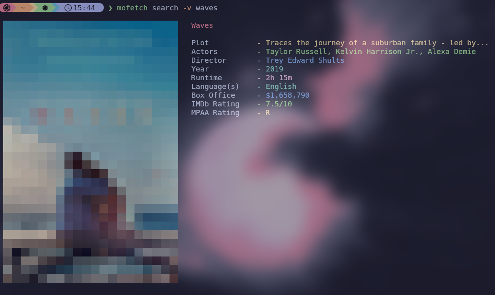

<h1 align="center">mofetch</h1>
<p align="center">

</p>

Neofetch-based app for movies!

## Features
- Search for any movie with posters and detailed information
- Customizable poster dimensions
- Customizable amount of information displayed
- Cross-platform support, works on any computer

## Installation

### Releases Tab
Simply go to the releases tab on this page, and select the appropriate file for your system.

The ZIP/tarball files are just source code.

If you are unsure of what version to download, run 
```bash
# On Windows Command Prompt
echo %PROCESSOR_ARCHITECTURE%

#On the Mac/Linux terminal
arch=$(uname -m)
case "$arch" in
    x86_64) echo "amd64" ;;
    aarch64 | arm64) echo "arm64" ;;
    i386 | i686) echo "386" ;;
    *) echo "$arch" ;;
esac
```

### Build from source
```bash
git clone https://github.com/ashish0kumar/mufetch.git
cd mufetch/
go build
sudo mv mufetch /usr/local/bin/
mufetch --help
```

## First-Time Authentication
1. Go to [the OMDB API website](https://www.omdbapi.com/apikey.aspx)
2. Select 'FREE! (1,000 daily limit)'
3. Enter in your email and name, put anything in for 'Use'
4. Click Submit
5. Check your email for the API Key
6. Run ```mofetch auth``` and paste in your API key.
7. Hit enter, and you're good to go!

The API key is stored in ~/.config/mofetch/config.yaml.

## Usage 

Searching for content can be done with ```mufetch search```
This command has two flags:
-verbose / -v toggles the verbose output during the search, with it set to off by default.
-size / -s changes the size of the poster, this is an integer value between 20 and 50, and is 20 by default.
Note that if you are searching for a movie with more than one word in the title, there must be dashes instead of whitespace (e.g ```the-brutalist``` instead of ```the brutalist```).

## Contributing

Contributions are always welcome! Whether you want to:

- Report bugs or issues
- Suggest new features
- Improve the visual design
- Enhance documentation
- Submit code improvements

Please feel free to open an issue or submit a pull request.

## Dependencies

- [**Cobra**](https://github.com/spf13/cobra) - CLI framework and command structure
- [**Viper**](https://github.com/spf13/viper) - Configuration management
- [**Imaging**](https://github.com/disintegration/imaging) - Image processing and resizing

## Acknowledgements

- Massive thanks to [Ashish Kumar](https://github.com/ashish0kumar), as I never would've been able to make this project without his Mufetch. He deserves more credit than I do, it's indicated in the code when some or all of the file was inspired by his project.
- Based off [neofetch](https://github.com/dylanaraps/neofetch) for the initial concept
- Thanks to [OMDB API]https://www.omdbapi.com/) for film metadata
